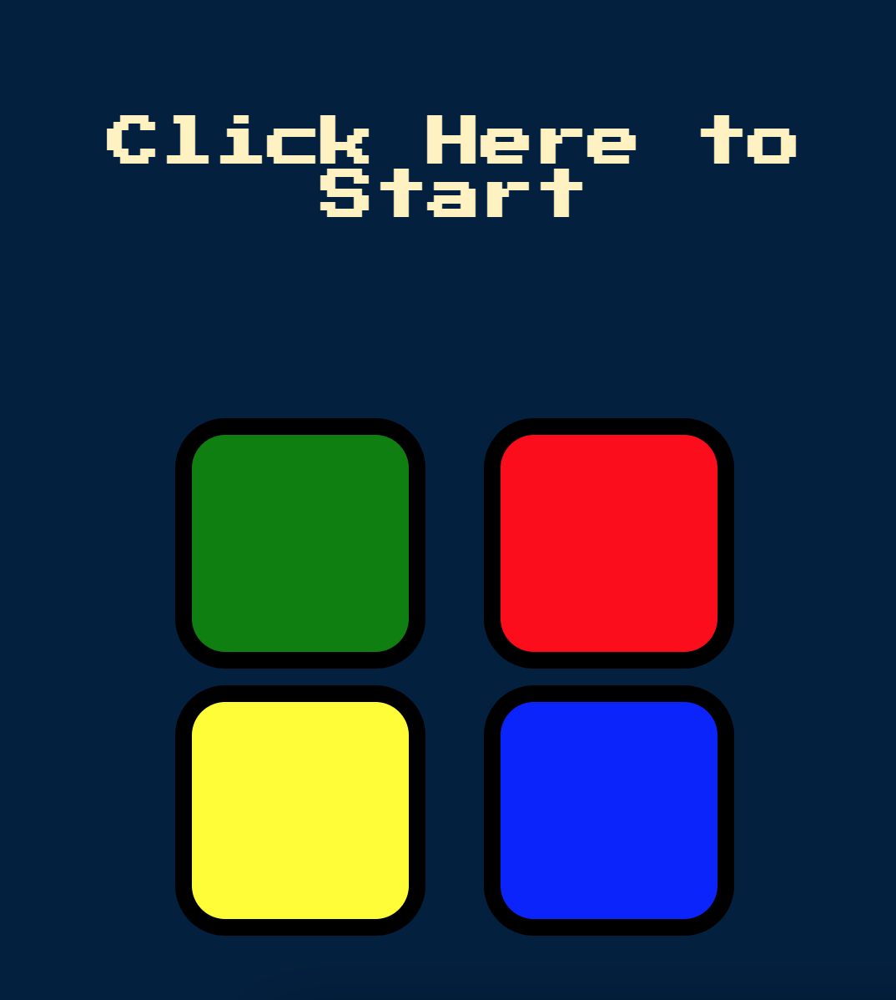
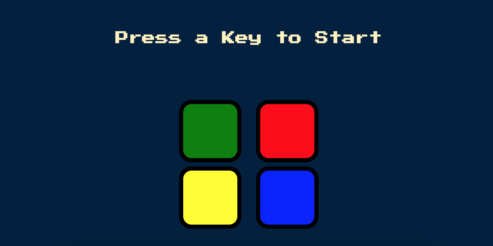

# Simon Game

A project developed to practice jQuery and logic. 
Simon is a classic electronic memory game that was invented by Ralph H. Baer and Howard J. Morrison in the late 1970s. The game is designed to test and improve a player's memory and concentration.

The Simon game consists of a console with four colored buttons: green, red, yellow, and blue. The console has a small display that shows a sequence of colors and plays corresponding tones. The game is played as follows:

When the user initiates the game by pressing a key on larger screens or clicking on the title on smaller screens, the game begins. It starts by illuminating one of the colored buttons and playing a matching sound. It's important to note that on smaller screens, the sound is not automatically played due to the requirement for user interaction. The player must then press the button that matches the lit one.

After the player successfully mimics the first pattern, the game adds another step to the sequence. It lights up and plays the first button again and then introduces a new button to the sequence. The player must reproduce the entire sequence, including the new addition.
The game continues to add steps and buttons to the sequence as the player progresses. The player's goal is to replicate the increasingly longer and more complex sequences accurately.

The game keeps track of the player's level, which is essentially the number of steps/rounds in the sequence successfully completed. If the player makes a mistake, the game provides feedback and ends the game.

### You can access Simon Game [here](https://jogosimon.netlify.app).

## Responsive Design

## Development Process

- Setting up the project starting files;
- Sketching the game logic;
- Making the HTML structure;
- Creating the buttons objects;
- Creating modular button components;
- Adding the components dynamically into the DOM;
- Styling the page elements and components from a mobile-first workflow;
- Testing the buttons;
- Creating a function to handle the button click animation;
- Creating a function to randomize the button blinks;
- Creating a function to save randomization in an array as well as the player buttons;
- Creating a function to start the next round.
- Add event listener for "keydown" to start the game;
- Implement the next round and keep track of the game's progress;
- Creating a function to compare the player's guess and the blinked buttons;
- Creating a function for the game over feedback;
-  Adapt the start of the game for smaller screens;
- Testing the project.

## Built with

- Semantic HTML5 markup;
- JavaScript;
- jQuery;
- Mobile-first workflow;

## Technologies and Tools

- [HTML5](https://html.com)
- [CSS3](https://www.w3.org/Style/CSS/)
- [JavaScript](https://www.javascript.com)
- [jQuery](https://jquery.com)

## Requirements

To work with the code, you will need, before you begin, to install on your machine Git and to have a source-code editor such as [VSCode](https://code.visualstudio.com).

## What I Learned

### Browsers Block Auto Playing on Smaller Screens:

- While testing the game on my phone I noticed that the randomization did not play a sound. The only time the sound played was when I clicked on the guessing buttons. Browsers have implemented policies to restrict or block auto-playing sound without user interaction. And here is why:

1. User Control: playing sounds without interaction might be disruptive depending on the environment like public and noise-sensitive places. By waiting for user interaction, it allowing users more control and gives them a better experience. 
2. Data Usage and Battery Life: playing a sound consumes data and battery, so in case of users with limited data plans or low battery that is a disadvantage. Waiting for user interaction gives them control over spending data playing multimedia content.
3. Accessibility: users with disabilities may screen readers or other needs. Auto-playing sounds might interfere with those assistive technologies.

### Exercising logic:
- This project had a few logical decisions to make and I could see there were many ways to approach it. I like it when the projects challenge my logical thinking and make me remember concepts. Here is one of the functions that required logic. It was developed to make the title blink when the game is over.

~~~
const toggleOpacity = (title, blinkCount) => {
    let count = 0;

    const blinkInterval = setInterval(() => {
        if (count % 2 === 0) {
            title.css('opacity', 1);
        } else {
            title.css('opacity', 0.2);
        }

        count++;

        // Each state of opacity should be active 3 times.
        if (count >= blinkCount * 2) {
            clearInterval(blinkInterval);
            title.css('opacity', 1); 
        }
    }, 300); 
};

export default toggleOpacity;
~~~

### Made with :heart: by [Caroline Almeida Nikolic](https://www.linkedin.com/in/carolinealmeidanikolic/)